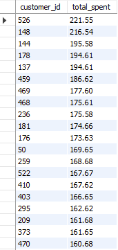
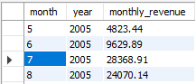
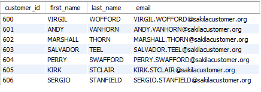
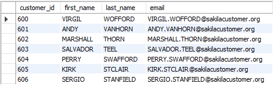

# sql-data-cleaning-projects
SQL practice projects using the MySQL Sakila database including data cleaning, joins, reporting, and analytics queries.

# MySQL Sakila SQL Practice

This repository contains SQL practice projects using the Sakila sample database.

Skills practiced:
- SELECT statements
- JOINs
- GROUP BY
- Data cleaning
- Subqueries
- CTEs
- Reporting and analytics

Tools Used:
- MySQL
- MySQL Workbench


# Top Customers Analysis

## Objective
Find the customers who spent the most money.

## SQL Query

```sql
SELECT customer_id,
       SUM(amount) AS total_spent
FROM payment
GROUP BY customer_id
ORDER BY total_spent DESC;
```


## Query Result



## Monthly Revenue

### Objective
Find total revenue by month.

### SQL Query

```sql
SELECT 
    YEAR(payment_date) AS year,
    MONTH(payment_date) AS month,
    SUM(amount) AS monthly_revenue
FROM payment
GROUP BY 
    YEAR(payment_date),
    MONTH(payment_date)
ORDER BY 
    year,
    month;
```

### Result




# Duplicate Detection in Customer Table

## Objective
Identify duplicate customer records in the customer table using different SQL techniques.

---

# Method 1 — Basic Duplicate Detection

This method uses `GROUP BY` and `HAVING` to identify duplicate email addresses.

### SQL Query

```sql
SELECT 
    email,
    COUNT(*) AS duplicate_count
FROM customer
GROUP BY email
HAVING COUNT(*) > 1;
```

### Explanation

- `GROUP BY email` groups matching email addresses together
- `COUNT(*)` counts how many times each email appears
- `HAVING COUNT(*) > 1` filters only duplicate records

This is a simple and effective method for identifying duplicate values in a table.

### Result



---

# Method 2 — Advanced Duplicate Detection Using Self Join

Since MySQL 5.7 does not support `ROW_NUMBER()` window functions, a self join was used to identify the actual duplicate rows.

### SQL Query

```sql
SELECT 
    c1.customer_id,
    c1.first_name,
    c1.last_name,
    c1.email
FROM customer c1
JOIN customer c2
    ON c1.email = c2.email
   AND c1.customer_id > c2.customer_id;
```

### Explanation

- The customer table is joined to itself using matching email addresses
- `c1.customer_id > c2.customer_id` keeps the lower customer ID as the original record
- Higher customer IDs are identified as duplicate records

This method is more advanced because it returns the specific duplicate rows instead of only counting duplicates.

### Result



---

# Skills Demonstrated

- GROUP BY
- HAVING
- COUNT
- Self Join
- Duplicate Detection
- Data Cleaning
- SQL Analysis


